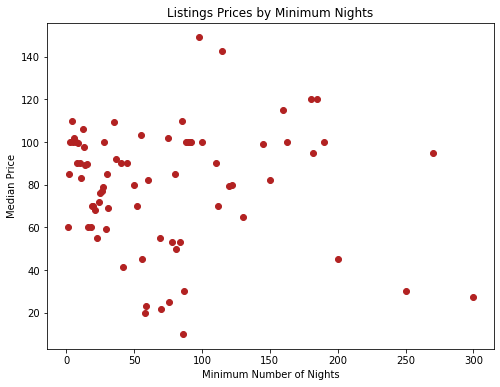

# Exploring the Factors that affect Airbnb Prices in London

## Focus Problem

 What are the most signifcant factors influencing Airbnb prices in London? 

## Executive Summary 

Having reported more than 100 million bookings in the first quarter of 2022, the Airbnb business has resurged from the pandemic and is booming. ‘Air Bed and Breakfast’ or Airbnb is essentially an online marketplace whereby those who wish to rent out their property are connected to people who are searching for accommodation when visiting that location. Airbnb has over 5.6 million listings across 220 countries globally and 100,000 locations. Some of its main competitors include Booking.com, TUI and Tripadvisor. 

Living in London ourselves, the key question we wanted to consider is what causes the prices of the hundreds of listings in London to fluctuate.

  
Above we see that a rental request for 4 adults in London for 3 nights brings about 2 significantly different results in terms of price per night. So what drives these variations? To help us answer this question, we extracted 66,000 of London’s listings from InsideAirbnb and used them to analyse the features a listing possessed and its effect on its price. We investigated features such as location, amenities and property type to identify possible correlation between these features and the listing’s price. We then extracted over 1 million reviews to understand the sentiment behind the most expensive listings. Furthermore, London is a world city as it is home to some of the best universities and it hosts a variety of international financial services thus there is high demand for property in this city. This also means that there is high competition for rental properties and small variations in price can make a significant difference in demand for the listing. If the price is too high, people will not be willing to pay and if the price is too low, the owners are losing potential income. Therefore through this project we used machine learning and regression analysis to help predict the base price for rental properties in London.

Through the use of tools such as Pandas, Matplotlib, Seaborn, and Python to analyse and visualise our data, we found that while there is some correlation with prices and the factors we have chosen to investigate (location, Wifi), others do not seem to have a trend (availability 365). Also, we have learned how to use Natural Processing Language to analyse comments (unstructured textual data)  which will be helpful for the hosts to understand each  guest’s activities, opinions and feedback to successfully derive their rental services. Furthermore, we learnt that predicting prices with Random Forest Regression is better compared to other selected machine learning regression models. However, we have to keep in mind that there are price outliers in the listings data, making machine learning a bit inefficient.

Overall, we recognize that the listings and reviews data are not perfect because the lead time at which they were gathered was 9th September 2021. Therefore, the factors may have a different relationship with the price today than the price from September. However, we see machine learning and python libraries have given the importance of reviews and have enabled us to make an approximate price prediction of listings for hosts and guests. This will encourage more research for  data analysts to help hosts see if their Airbnb price could be sensitive to the change of such factors observed.

Finally, we were able to put together a list of recommendations to prospective guests and hosts in order to make the most value out of their next property rental. Two examples of these include:
- Location is an important factor that affects prices 
- The most expensive boroughs are in the centre of London (Kensington, Chelsea, City of London, Westminster)
- Top amenities an aspiring host should include: Wifi, smoke alarm, essentials, heating, long term stay allowed

## Motivation

Our initial motivation for this project stemmed from our awareness of Airbnb scams being presented on the news quite frequently. Thus, we initially wanted to base our project around identifying scam listings, however we decided to change the route of this project into something broader and useful to us as students. Since 2007, Airbnb has vastly expanded across many countries and has disrupted the hospitality sector as people move away from traditional hotel and resort bookings. We were really interested in exploring this topic as Airbnb has revolutionised the property rental market and has made it much easier and more affordable to travel thus making it a great way for students to explore countries. As we all study Economics, this topic was of particular relevance to us as we are aware that Airbnb capitalises upon the sharing economy thus it was intriguing to use the array of data points to find out how hosts could increase their revenue. Also, due to having an interest in financial markets, Airbnb is a stock that will continue to keep growing due to its disruptive nature therefore analysing its market structure and how they can reign in more revenue is particularly interesting.

With so many different properties in each location, it becomes difficult to find the perfect one that is good value for money, in a convenient location with tourist attractions and is equipped with the amenities we need. Furthermore, through a quick surf through Airbnb’s website, we see many listings that look very similar in photos but are priced very differently thus we wanted to delve deeper into the hidden discrepancies that may be causing these price variations. 

## Justification

Our project is relevant to all three stakeholders - rental property hosts, the firm and guests. Analysis of the factors that make a listing more expensive means that hosts can ensure their listing has all the essential features and amenities to charge a higher price. As well as this, guests are informed of what factors make a listing cheaper and that the property they have chosen includes features that they want. Although Airbnb is able to give general advice to help hosts price their listings, there are not many services that are able to use several data points to accurately predict the price of a listing thus we deemed it fit to include a machine learning model that could help forecast base prices.  

Our project is particularly relevant now because there has been a bounce back in the holiday market. In fact, Airbnb bookings hit a record high in March of 2022 according to Airbnb’s financial results. Airbnb was rapidly growing in 2020, but after COVID-19 caused a strike to the travel industry, there was a severe fall in booking numbers. On a year on year basis, bookings fell by 72% and at one point there were more cancellations than bookings due to travel restrictions. This placed pressure on Airbnb and all the hosts who were losing revenue due to the significant decrease in bookings being made. There was resilience as people began to travel domestically, however now the travel industry has made a full comeback with bustling airports over the Jubilee Bank Holiday Weekend, for example. It is now more important than ever that hosts have accurately priced their listings and filled them with the most sought after amenities and facilities to avoid making further losses. Looking at reviews is also particularly important as reviews build up communication and trust between the listing owner and guests. This constructive criticism also allows property owners to refine their listing according to their guest’s desires. Thus we decided that conducting sentiment analysis on the reviews from the listings  that bring in the most revenue would be extremely important within our data analysis.

## Aims
The primary aim of this project is to explore the factors that influence Airbnb prices in London. The secondary aim of this project is to create a mechanism in order to predict prices of listings in London using machine learning.

Airbnb has become a disruptor in the market for property rentals thus has become a relatively easy way for people to earn extra income through investing in new properties and renting them out via Airbnb. Guests often find Airbnbs to be cheaper and tend to prefer them over hotels due to the ‘homier’ feel. However, as Airbnb rapidly expands with thousands of new listings being added everyday, we wanted to find out what type of properties a host should invest in and what features they should include in order to make the most rental revenue and to retain customers leading us to our first question: what are the most important factors influencing pricing? To address this we decided to look at the features that are common among the most expensive listings - location, amenities and so on.

We also wanted to analyse the impact of reviews and if the actual content of the written reviews is significant.

The key questions we aim to answer through our project are: 
1. What are the most important factors influencing pricing?
2. What is the correlation between these factors and prices?
3. Why is or isn’t there a correlation?
4. Do reviews actually matter?
5. How can we use machine learning to help us predict prices of rental properties?
 

## Data
### What data do we want?

To answer our questions within our aims, we need data on the reviews of the most demanded and expensive listings and we also need data on the different features that a listing possesses. For example, the number of guests it hosts, whether the owner is a superhost, which amenities the listing includes and the location of the property. Of course, with thousands of listings across London comes millions of reviews under each one so it was important to limit our dataset. In order to make it easier to analyse, we took a sample of the reviews but we made sure that we would still have sufficient data to analyse.

### Time period

COVID-19 created a significant setback to listings and revenues so we decided it would be appropriate to conduct our analysis on data after the severity of the pandemic reduced therefore the dataset we are using was compiled on 9 September 2021 in order to give us a clearer idea of the factors affecting a price and to create more accurate price forecasting using machine learning.

## Getting Our Data

Initially we did face some challenges with finding a suitable dataset as sources such as Kaggle did not provide us with comprehensive enough information and missed out crucial points such as amenities.

The datasets that we have used for this project come from InsideAirbnb.com which is a mission-driven activist project that scrapes Airbnb reviews and listings across different cities globally. InsideAirbnb provided us with two relevant CSV files on both listings and reviews. We chose the detailed version of the dataset over the summarised version as it included a wider array of data points such as the number of bedrooms and the types of amenities (wifi, heating, free parking, hot water etc ). These datasets were initially formed to highlight illegal listings on the platform that Murray Cox believed were distorting the housing market. It delivers curated statistics to cities that seek to rein in the home-sharing market. The datasets from InsideAirbnb can be considered factual as it is scraped directly from the Airbnb website and the publisher does not alter the data. The data is unlikely to be biased as it is all quantitative and publicly available. 

We used 2 datasets shown below. The screenshots show a randomly selected sample of each raw dataset opened in Excel.

1. Listings.csv

This dataset contains information about Airbnb listings, including neighbourhood, property type and so on. There are 66000 rows and 74 columns. These columns were the factors we analysed against median prices. 

2. Reviews.csv

This dataset contains written comments by guests about their experiences in a particular Airbnb. There are over 1 million rows of reviews, with some listings (given by listing_id) having multiple reviews. 

Sample of a negative review: (polarity score < 0):

Sample of a neutral review (polarity score = 0):

Sample of a positive review (polarity score > 0):

### Obtaining Data

In order to conduct our analysis and visualisations from our data we used Python to format the raw dataset and then organised and filtered out unwanted columns.

First 5 rows of the formatted dataframe in Jupyter notebook (df.head(n=5)): 

Listings

Reviews

### Limitaitons of Dataset

1. There may be possible bias in data as it could lack context. For example, not all listings are ‘active’, which means that just because an apartment is listed and included in the data, does not mean it’s available to rent out. Also, the data does not take into consideration the fact that multiple listings may be advertising the same property. However, academics have argued that the creator still portrays a fair and accurate representation of Airbnb
2. In terms of limitations of our analysis, the data is based on advertised/sticker prices rather than what is actually paid so this slightly affected our results. There were some extreme values of prices that had an impact on some calculations and visualisations therefore we decided to use median prices instead of mean prices to limit the effect of outliers.

Example of outlier:

3. The sheer number of reviews (over a million) poses a technical shortcoming as it would be too difficult to conduct sentiment analysis on all of these. As a result of this, our analysis does not include all of the comments but instead a random sample of the top comments that were included in the most expensive listings. 
4. Furthermore, there is great subjectivity to what makes a positive or negative review. To combat this we used Textblob sentiment to create polarity scores for the reviews. A score greater than 0 indicated a positive review and a score less than 0 was taken to be a negative review. 

### Descriptive Statistics of dataset

Descriptive statistics are useful as they can help us understand the collective properties of the elements of a data sample to gauge a better idea of the overall picture a dataset gives us. 

Overall we were looking at both continuous and discrete numerical data in terms of pricing, number of guests etc and nominal categorical textual data in the reviews, locations and amenities.

Central Tendency

The median price of all listings was £85. We opted to focus on median prices over mean prices to avoid the problems caused by outliers and extreme values within the dataset. 

Dispersion

There was a wide range of prices across the listings ranging from ____ - our limit of £1000

## Methodology

We used Python and Jupyter Notebook to analyse the datasets. The first thing we focused on was cleaning the data to remove erroneous, irrelevant, incorrectly formatted or duplicated information that would negatively influence our analysis and exploration. The steps we followed are detailed in the code, but the main things we focused on were dropping unwanted columns and null values or inconsistent entries from certain columns, converting data types where applicable as well as limiting prices. We were careful not to manipulate data too much but instead ensured that the data was cleaned only to the extent that it could be more easily and appropriately analysed, which was especially important as our project relied heavily on graphs.

This was followed by data exploration and modelling using the matplotlib and seaborn packages through the plotting of graphs such as bar charts and and maps. We analysed each factor separately - these included the number of bedrooms, location, the number of listings per host, the availability of the airbnb and so on - by determining their effect on the median price of the Airbnb listing. While we originally plotted graphs of factors against mean prices, we eventually decided to use median prices, which we found to be a better measure because it is less skewed by extreme values. Even after reducing the maximum price from £16700 to £1000, the range of prices which starts from £7 is still very wide, and thus median prices provide a more faithful representation.

As delineated in our code, we chose graph types based on what we felt suited the data best and that enabled us to visualise it and determine a correlation in the most appropriate way, whether it was a map, bar or scatter plot.

In some graphs such as that of the minimum number of nights versus price, we identified extreme outliers which hindered our ability to identify a pattern. To avoid changing the data completely, we removed outliers using the interquartile method but still kept the original graph to compare the two. While we understood that ‘true outliers’ represent natural variations and should be kept in the dataset, in this case, we removed them to get a clearer idea of the distribution of the scatter points. However, in most of our other graphs, we did not change the results even if it did not match our predictions at all, because this would have reduced the accuracy and validity of our analysis.

In the reviews data, the comments were cleaned and preprocessed  by filtering out the empty comments, removing the unicode characters, changing it to lowercase, removing the windows to new lines, removing all the stop words, and replacing the amount of spaces to one space. Given that all of the comments were in sentences, they were split into words using the word_tokenize in NLTK library. The words were captured using the Count_Vectorizer() and was created as a separate dataframe to explore the amount of times those top 20 words occurred. This will make it easier to create WordCloud of the top words in the ‘comments’ column.

In comparison of the reviews_score_ratings and price, the prices were changed into floats and plotted the graph using matplotlib.

To analyse the names of properties with top 100 cheapest and expensive listings, we selected ‘names’ and ‘price’ from the listings data. Then, we created 2 dataframes for both the top 100 expensive and cheapest listings, which include the ‘names’. After preprocessing the dataframes using the same steps for cleaning the comments with NLTK, then WordCloud was created for both dataframes with the help of matplotlib.

To calculate the subjectivity and polarity of the 10000 comments in the reviews data, we used Textblob sentiment after cleaning the textual data.  Then, we analysed the polarity scores to see whether it is a negative comment as the score is less than zero, neutral comment as the score is equal to zero, or a positive comment as the score is greater than zero.

For the amenities, the data was cleaned by removing the NaN values and then the amenities section was changed into lists and was able to string replace the brackets and the apostrophes to create a set of all possible amenities.

Then, we grouped each amenity into a certain category, if they have the same words/meaning but are in different letter cases or words. Here is a screenshot of the process:

Then, we used the train_test split model (70:30 split) and accuracy scores to calculate the Feature Importance using Decision Tree and Random Forest classifier, which are available in the “scikit-learn” library of the python-based open source data analytics platform and the plots were created using Matplotlib.

Then, the NaN values were replaced by zeros in the columns. We drop the infrequent columns by creating a list of the amenity columns that have fewer  than 10% of listings. This led to our remaining amenities that were analysed below for features importance.

For the top amenities, the data was cleaned by removing the NaN values and then the amenities were separated using the numpy concentrate to count the top 20 amenities. Then, we plotted this using matplotlib.

For predicting prices, the process is explained below. The sklearn package was used to calculate each model (Linear Regression, Multiple Regression, Random Forest, KNN and Decision Tree. First, exclude the properties with listed prices of zero values. After, we replaced null values with zero values for “reviews_per month” and “host_listing_count”, and then encoded categorical values as integers.  The dataset was horizontally split into training and test data sets and also split into features (=X_train and X_test) and target (y_train and y_test). 

## Results

### Background

Before starting the project, we did some research on how Airbnb prices are generally set. While Airbnb gives a few recommendations to hosts, such as to conduct market research, consider the location and amenities, ultimately the host has their own personal pricing strategy and decides the price based on what they think matters the most.

Airbnb also has a Smart Pricing tool, which is an algorithm that generates price tips from metrics related to the property and recommends an ‘ideal’ price. The tool takes into account local demand, amenities, the number and ratings of reviews, room type, calendar availability and so on.

The issue with our project is that the prices we analysed are only from a specific point in time (when the data was scraped), which might not be extremely accurate as prices are constantly fluctuating and being updated.

Some Airbnbs also had additional service or cleaning fees which we realised could have significant effects on prices, especially because they are a flat fee rather than a nightly cost.

*Prices above £1000 are due to Airbnb hosts not understanding how to set 'sticker' prices correctly. Hence, we set a maximum price limit of £1000. Due to limitations of the data obtained from Inside Airbnb, our model will analyse advertised prices rather than prices actually paid, as we are unable to obtain this information.  

### General overiview of datasets

**1. Distribution of Median Prices**

Just to give a general picture of the prices of the Airbnb listings in the dataset, we plotted a graph to demonstrate the distribution. The vertical dotted line indicates the median price of all the listings (£85), which seems reasonable, and the distribution is skewed to the right with prices mostly under £200 a night. This is useful to us in the analysis of factors against price, as we were able to determine whether the results were more similar or different to what was expected and whether they were reasonable, especially given the fact that outliers sometimes altered results. 

**2. Heat Map**

We plotted a heat map which we hoped would give us a general overview or indication of which factors affect prices the most, and found that the top few included the number of people it accommodates, bedrooms, beds and the total of host listings. The top 3, however, were expected as undoubtedly the price of an Airbnb for 5 people would normally be more expensive than that for 1 as it would be bigger, have more bedrooms and so on. Hence, we can also see strong positive correlations between accommodates, bedrooms and beds. A limitation of this is that it included factors with numerical values.

### Zooming in - Sub Problem 1: What is the effect of Individual Factors of a Property on Median Price?

**1. Is the host a superhost?**

This was a surprising result. Being an Airbnb consumer ourselves, we tend to look at whether the host is a superhost or not before making a final decision. However, based on the graphs, we can see that being a superhost does not actually have a positive effect on the prices of the Airbnb listings, but instead has a negative one.

**2. Is the host’s identity verified?**

The results suggest that Airbnb listings posted on the site by hosts who have verified their identity have a median price about £20 higher than those who do not, which is quite a significant difference given that this is a 33% increase from the median price of listings whose hosts do not have verified identities.

**3. Can the Airbnb be booked instantly?**

Whether the Airbnb can be booked instantly has a similar effect on price as the superhost factor, with instantly bookable listings having a lower median price.

The trends in prices of these three (true vs false) factors were correlated with the category counts, which may or may not be a coincidence. A  problem we found throughout our analysis that might explain the results was that where there were significant differences in the number of Airbnb listings in each category, the factor’s effect on price was the opposite of what we expected. This could be due to the more pronounced impact of extreme prices on the median value when there are fewer listings in a particular category, causing the results to change quite significantly. 

**4. Total number of listings per host**

The first graph depicts the change in median price when the number of total listings each host has increases, after outliers were removed. The graph below shows a similar graph with a different scale and a regression line of best fit plotted with seaborn. 

**5. Number of guests accommodated**

We found that the more guests accommodated, the higher the prices. However, it is not fully the case as 13 guests and 15 guests are accommodated around the median price of 7 guests. Therefore, there is not a clear picture of the correlation between number of guests accommodated and the median price, as other factors could also be coming into play.

**6. Which neighbourhoods in London are the most popular and where are the most expensive listings?**

We used a map to illustrate the number of Airbnb listings according to neighbourhood as well as the median price. We then compared this to a heat map from Zoopla, a real estate company, which showed the relative prices of housing in London boroughs. As expected, it had a similar trend with the most expensive boroughs located in the middle of London. However, as the map does not tell us the specific names of neighbourhoods, we also plotted it on a horizontal bar chart to see the differences more clearly.

This bar plot shows us to identify that the top 4 boroughs with the highest median prices of Airbnb listings are Kensington and Chelsea, City of London, Westminster and Camden. This was slightly different from the graph I plotted before the prices were limited, but the top 5 most expensive neighbourhoods are still the same, just in a different order. Using the map from Zoopla (which allowed us to look at the names of boroughs), the top 4 were Kensington and Chelsea, Westminster, Hammersmith and Fulham and Camden. This was almost the same as what we found, suggesting that Airbnb prices are generally consistent with the trends in for-sale property prices.

The data we found suggests that there is likely to be displacement for communities in the priciest neighbourhoods, especially given the fact that the number of Airbnb listings in London has increased 571%. This is known as tourism gentrification, where tourists displace residents from their local communities through increases in rental prices and decreased housing availability, making it difficult for people to find an affordable home to rent in their local neighbourhood. 

**7. Property Type**

This simply shows the number of each listing. Since we have 85 unique property types, we decided to group them as 'Freestanding', 'Attached', ‘Luxury’ and 'Other'. This was based on our own judgement of which category we thought fit the property most appropriately. The categories were decided in this manner:

1. Freestanding - properties with a freestanding house and land immediately around it (privacy)
   - Includes: townhouse, residential home, bungalow, cottage

2. Attached - properties connected to larger complexes with multiple units
   - Includes: condominium, hostel, hotel, guest house

3. Luxury - higher-end properties (e.g. a splurge as part of a destination wedding or other event)
   - Includes: villa, chalet, vacation home

4. Other - unique properties that fit into none of the above categories
   - Includes: boat, barn

We expected luxury properties to have the highest median price, but it was surprising that it was the lowest. This could have been affected by the location, or by the small sample size which may have had extreme values (especially because we did not differentiate between an entire place and a shared room when plotting these graphs) and fluctuations that caused the median to be lower.

For example, we found that townhouses are more expensive than villas, with an entire townhouse costing around £1183 per night, while a unique villa costs around £773 per night as shown in our Airbnb website investigation.

**8. Room Type**

We replaced hotel rooms with private rooms, since there are only 3 types of rooms shown on the Airbnb website. These results were consistent with what we expected, as entire homes or apartments are significantly more expensive than single rooms. 

**9. Beds and Bedrooms**

The graphs clearly show that initially, the median price increases with the number of beds and bedrooms. However, after a certain point, the trend breaks off. This could be due to the fact that Airbnbs with more bedrooms (possibly above 8) were dormitories, which are bound to be cheaper per person and ultimately have lower prices than listings with fewer bedrooms and that might be chalets or villas. We realised that we could not analyse the effect of the number of beds/bedrooms individually, but that these were also linked to the property type.

Despite the fact that there is no constant trend, our results still can still give guests a rough idea of the approximate price of Airbnbs with a certain number of bedrooms and beds. For instance, a 15-bed shared room in a hostel would cost about £26.50 a night, while an 8 bedroom villa with 11 beds would be £900. Therefore, our initial expectations were too simple and hence inaccurate because we did not consider the external effects of property type or amenities.

The distributions are skewed to the left and they are not well distributed as there are fluctuations within small amounts. For example, the price drops from around £400 to £300 per night for 9 to 10 bedrooms before skyrocketing back to $1000 per night for a place with 11 bathrooms in London.

**10. Bathrooms**

As the number of bathrooms ranged from 0 to 165, we chose a scatter plot instead of the same bar chart used for the graphs of beds or bedrooms against price. The results and line of best fit show that there is no clear trend between the number of bathrooms and price, which suggests that this might not be one of the main factors that hosts should focus on when setting their listing price. However, our results were also affected by the fact that there were fewer than 5 listings with certain bathrooms, such as 75, 105, 125 and so on, and this could have lowered the accuracy. This is evidenced by the fact that the points that show a median price of £1000 (the maximum) are for 10, 17, and 65 bathrooms, all of which only have one listing each.

Given that the number of bathrooms in an Airbnb is dependent on the number of guests it accommodates, beds as well as the size of the property, these factors could be confounding variables that affect the prices, rather than simply the bathroom count. 

**11. Availability 365**

We found no trend from the data, and the only observation we made was that the Airbnbs available for 0 out of the next 365 days have the lowest mean price. This was surprising as we expected that fully booked Airbnbs would have higher demand and thus a higher price. However, we did realise that these prices are a snapshot in time, and thus the fact that they were not available at the point of data collection could have affected the median price.

**12. Minimum Nights**

Since we were unable to see a trend from the first graph (left), we decided to remove the outliers, not with the intention of manipulating our results, but simply to compare the difference and see if we could observe a clearer pattern of the points in a cluster. However, there still was not much correlation between the minimum number of nights a customer needs to stay in an Airbnb and the listing price, which means that hosts do not need to focus on choosing their price based on this factor. 

**13. Amenities**

We could not quite determine how the prices changed according to which amenities the Airbnb included (i.e. whether their presence caused prices to increase or decrease), but we did find out the amenities that affected prices the most.

The train/validation/test split was used because the listing.csv is a large data set. Using the train_size of 0.7 and random state of 42 for both Decision Tree and Random Forest models. 

The amenities were set as nominal variables in which a column is made for each of the categorical values. Then the binary value is inserted signifying whether that entry has a categorical value or not. If the entry had the categorical value, 1 is entered and 0 otherwise. 

Amenities were stored as one big block of text in each row. In order to figure out what the various options were and which listings had them. So, we made the comments into a string and cleaned the text by removing any unnecessary characters. Therefore, create a set of the resultant list which was able to find the feature importance on price. 

In the Decision model, we can see that the top amenities that have high feature importance when setting the prices are parking, white goods (which consists of fridges, washing machines etc), tv, coffee machine, long-stays and cooking basics (which consists of stoves, oven), and others are shown in the bar chart. The other amenities features which were more infrequently mentioned were removed, as it would have been harder to analyse the importance of amenities that appear very few times.  From the 2020 publication of the most filtered amenities, we found that free parking, a kitchen, and internet are important. This shows that the data in listing.csv have some validity in mirroring the popular amenities among consumers, even though it is old data from a few years back (Airbnb, 2020).

Using the Random Forest Regression, the top amenities are white goods, parking, and bed linen, tv.  It seems that they have a good prediction of what guests are looking for. 

From the below graphs, we can infer that the parking and white goods are the most important features for listing. This is helpful for the hosts when bidding their prices or selling out their properties to take into consideration what they already have.  

In London, new hosts should note that they may be able to increase their listing price if the property includes parking spaces and white goods to attract more guests who demand such amenities. 

We can see that the listings with the highest prices have amenities such as Wifi, Smoke alarm, Essentials, Heating, Long term stay allowed. So, an aspiring Airbnb host ensures his property contains these amenities so that he can charge a higher price. Similarly, if a traveller doesn’t require any of these amenities, he can opt for a listing without them to save cost. Amenities and their influence on the price will be explored future in-depth in the machine learning section of the project.

Using the NumPy concatenate, the top 20 amenities were counted and the results showed that wifi, smoke alarms and essentials in properties are more popular among the hosts. Compared to the previous data, it showed that parking space and white_space are the most important, which means that the host should invest in those amenities to be profitable.

Though, with limited data, wifi could be more important than the machine learning analysis on which amenities are important. The reason why wifi may be provided more is that it is super important for the guests. So, the comparison may be invalid in this case. To support my point, we see that Wi-Fi is not part of the top 5 amenities from the feature importance. That is because almost all homes have Wi-Fi/internet nowadays! It was expected that WiFi would not affect the prices significantly.

Overall, amenities, such as Wifi and parking spaces, does affect price, as shown in our findings. Therefore, these amenities should be considered by the hosts when posting their rental properties in Airbnb.

### Sub Problem 2: Do reviews actually matter?

It is viewed that a higher overall review score (5) is given to the most properties that are less than $400 (around £300). This shows that the overall review score is not positively correlated with prices. Also, there are some expensive listings with low review ratings.

This links to the feature importance on price as  review_score_rating  are not as important in predicting prices. Overall, there’s no correlation between the review_score_rating and the prices. This means that cheaper listings can have either absolute best services or the worst services than the expensive listings (which seem to have a somewhat better review score from $400). This means that there could be other aspects of the Airbnb rentals that lead to the score rating. This is where analysing comments becomes important to find the reasoning behind the review score rating.

We can see that most reviews range from 0 to 5 reviews per month across all prices. However, the data shows the number of reviews across any month. It has been evidently seen that at $175, there are 25 reviews per month which are the highest compared to other prices. This shows that reviews are important when setting prices because they will lead to more attractions as the customers have a better understanding of how the properties and the stay are.

The reviews per month are more situated around the prices below $10000. This means that the reviews_per_month may be requested more by the hosts/owners to boost their popularity or reduce seeking guests’ suspicions. This is because they may be more convinced to book the apartment if they read about the experiences of the previous guest and do not fully associate  the low price with a low-quality property.

**Sentiment Analysis**

In the comments, which is a free form text column in the reviews.csv, there were instances where these values are not strictly in English only.

However, we didn’t adjust it and looked more at the English comments as this language barrier was just a minor issue. The NLTK is a go-to package in Python to obtain a numerical sentiment value of positive, negative and compound(combined) of any given English text. 

The comments from above for each listing were analysed using Textblob sentiment analysis models. This method assigns a score between -1 and 1 to each review and the scores are averaged across each listing.

This is the first 10000 comments that were analysed. We can see that there are more positive comments as demonstrated below. 

Importance of text sentiment polarity:
- When people are searching for a place, many choose to look at the comments and look at the average scores. For the sentiment classification, TextBlob included giving sentiment scores. Based on the polarity of the general score, a listing can go from -1 (absolute negative sentiment) to 0 (absolute natural sentiment), to 1(absolute positive sentiment). This is important for a host when deciding to write a summary about a listing to customers. Many hosts use more positive language, while others are neutral.
- However, some don't give a full picture and are hard to read, which are “made” and “would” as shown in the WordCloud of the top words in the comments. The fact that “great” appears in several comments, means that the properties in London have wonderful hosts. For example, there are some comments which contain “sad” but with human analysis, it turns out to be a positive comment. Therefore, TextBlob is not perfect in sentiment analysis. 

**Names of the Property compared to Prices**

Both attributes, names and comments are free-form text. The name is the title of the property the host provided, while comments are left by the guests that have stayed in them.

“Name” is found in listing.csv and  comments can be found in reviews.csv.

Created a dataset and WordCloud of the top 100 most expensive listings: 

Created a dataset and WordCloud of the top 100 cheapest listings:

Here we have seen the most common words in the summary of the cheapest listings. As it can be seen from WordCloud, indeed there are overlapping words with the most expensive listings. Words like: 'bedroom', 'family', and 'flat' appear frequently in both. So they do not tell us anything special. However, words like: 'apartment', 'near' & 'central' appear more frequently in inexpensive listings as opposed to cheaper listings. Indeed,  it turns out that there are certain words which appear more frequently among expensive listings.

**Comments without price comparison**

Using the Nltk CountVectorizer(), the top 10 common words in the comments are shown below: 

This word cloud shows the most frequently used words in the comments. We can see that ``great”, location”, clean”, place”, and “recommend” are mostly featured in the comments.  The host is definitely one of the most valuable aspects, essentially for his/her availability, help and welcome. This is what guests are looking for when booking a rental. However, it is difficult to understand the actual context of each review as it could be given with a negative token,  such as “not” e.g “not great”.

Furthermore,  it doesn't help to explain how it relates to prices. However, it does give an idea to the hosts of what people are commenting on AirBnB nowadays and may use it to describe their properties. This allows us to see how hosts are naming their property, and what words the guests  can expect to see in the comments section when browsing for an Airbnb. 

Overall, names of properties(textual data) and sentiment analysis of the comments does affect price.

**Overall Feature Importance of Selected Factors**

These graphs were plotted using different modules - the Decision Tree Classifier (left) and Random Forest Regression (right). The decision tree, however, tends to overfit data and thus we found that the random forest model was more accurate because it chooses features randomly during the training process. This model, which produced the graph on the right, suggests that the total number of listings per host was the most important factor. This could be because more experienced hosts know the market better and are able to adopt a more appropriate pricing strategy. It is almost given that factors like the number of bedrooms, bathrooms, beds and guests accommodated were close to the top in terms of importance, but what was slightly surprising was that review scores did not seem to matter as much as we expected. A different project that conducted a similar investigation found that review scores for things like location, cleanliness and so on made up several of the top 10 most influential attributes on price per person, but it is possible that our results are the way they are because most of the listings have similar ratings of 4-5 stars, despite the large range of prices, which means that other factors could play larger roles.

A limitation of the feature importance graphs (as well as the heat map) is that it was plotted only with factors that had numerical (integer/float) values, and thus did not incorporate amenities, location, property or room type. Furthermore, despite the fact that certain factors were found to be of highest importance in determining price, our individual analysis of them shows that the correlations were still not very strong. 

A few reasons we came up to explain this phenomenon include:
- Some hosts might not know how to price their listings and may simply choose a price without following any real approach
- Pricings would be quite subjective because different individuals would attach different levels of importance to certain factors
   - For instance, one host might think that having more bathrooms is important and thus would charge a higher price simply because of this, but another might not. 

### Sub Problem 3: Can we Predict Prices Using Machine Learning?

Reason for predicting London Airbnb rental prices:

As house prices rise annually, it is necessary to create a mechanism (using machine learning models) to forecast future AirBnB properties. Landowners, estate values, hosts, investors and guests may use the house price prediction to calculate the valuation of a rental property, especially because individual factors such as physical condition, styles, reviews and location all  influence listing prices.

Summary of Data Cleaning process:
1. Dropping the irrelevant variables, and includes “host_id”, "minimum_nights" etc
2. Exclude the properties with listed prices of 0
3. Filling the missing NaN in “reviews_per month” and “host_total_listing_count” with 0 values
4. Creating a dummy for the categorical variables. Data_encoded(“minimum_night”)

The Train and Test Split: 

The Test and Train group shapes  for Hosting_Listing_count, Neighbourhood_cleansed_Cat and Room_type_Cat were (46632,3) and (19986,3), respectively.

One would perform TTS on a data set randomly(apart from time series). So, we  separated the models into 2 groups: train and test. This allows us to use one set to train the model on and then another to test it with. For a large-sized dataset like ours, a 70/30 split between train and test is usually conventional.

The simplest way you could create a train and trust dataset from the initial one is by using Scikit-learn’s train_test split function with the test size = 0.3. This would however lead to one issue: The target value( i.e price) could be biassed by chance.

1. Linear Regression 

The reason why to choose availability_365 as an independent variable is because it is one of the top important features to predict prices. Furthermore, the customers are interested mainly in the availability of the property when one is booking in AirBnB. 

Linear Regression was set as a baseline model on the dataset using all of the features as model inputs. A python package, Sklearn, was used to calculate this model; the results are as follows:
- intercept: 0.1668724
- The coefficient is 129.48. By checking the R-squared, we can see that less than half of the variance in the outcome variable(price)  can be explained by the model. 

2. Multiple Regression 

This is the screenshot of the independent variables and dependent variables:
- host_total_listings_count: number of listings owned and operated by a single host. This shows how experienced the host is when setting prices. Therefore, it will be a strong comparison when predicting prices for certain situations.
- Neighbourhood_cleansed_Cat: this is where the location becomes important in predicting prices. For example, if the neighbourhood is in-demand, then raise the prices and if the neighbourhood is in less demand, then lower prices. This was encoded into ordinal values.
- Room_type_Cat: If the room offers an en-suite bathroom or a private balcony, it will help the rental property to stand out and this will affect the price. This was encoded into ordinal values. 

This multiple regression provides these  results:
- intercept: 155
- Coefficient: 0.07 for the host_total_listing_counts, 1.15 for the neighbourhood_cleansed_Cat, and -51.002 for room_type_Cat.

3. KKN(K-Nearest Neighbours) Regression 

K-Nearest Neighbours is a type of instance-based learning. For this technique, the model tries to find a number (k) of training examples closest in distance to a new point, and predict the output for this new point from these closest neighbours. The feature importance was calculated using the KNN Classifier of scklearn package. 

4. Decision Tree

The purpose is to create a model that predicts the value of the target variable by learning simple decision rules from data features. We use the same independent variables as shown in the multiple regression. This was done using Sklearn and the Decision Classifier(random-state= 42).

Limitation of Decision Tree: The technique requires advanced knowledge such as pruning or setting the maximum depth of the tree to avoid such problems with an assembled tree(VlahovIjak Alen. 2022). 

5. Random Forest 

A random forest is a meta estimator (n_estimator =1000 and random-state= 42)  that fits a number of classifying decision trees on various sub-samples of the dataset and uses averaging to improve the predictive accuracy and control over-fitting (Scikit-learn.org). The independent variables from the multiple regression are used.

The important error metrics for each model are used to analyse the overfitting of the data:
- Mean Absolute Error(MAE)
- Mean Squared Error(MSE)
- Rooted Mean Squared Error(RMSE)
- R-squared(R2)

Among all tested models, Random Forest performs the best and produces the lowest RMSE, MSE and the highest R2  on the train-test sets in terms of price, compared to other algorithms (KNN, Decision Tree, Linear Regression and Multiple Regression). This level of accuracy is a promising outcome given the heterogeneity of the dataset, therefore the hosts, guests and investors can use this model with more means to try to reduce error by a few cents.

However, the Random Forest model produces the highest MSE, which means that there are outliers on the errors as demonstrated below in boxplots. For example, it shows that the Random Forest (RF) test model has the median of prediction error (MAE) of around $26 and the interquartile range is around $30. This means that 50% of the sample could be right and another 505 may be very wrong. It will be cheating to improve the regression models to drop the outliers due to  the cost of removing valuable price observations. The outliers may factor in where some of the hosts set their Airbnb at very highly skewed prices because of other unique characteristics that are not accounted for, such as minimum nights, reviews ratings. Furthermore, there is a bit of selection bias when selecting the parameters of the train and test split and evaluation. 

This shows that machine learning may not be perfect as the data may have not been processed before due to several NaN values and the data being static.

## Conclusion

Based on the individual analysis of factors, we found that it was difficult to isolate them and determine their correlation with median prices due to the confounding effects of other variables that are all interdependent.

However, some factors that are worth advising hosts and guests on are: 
- Hosts should ensure that they have verified their identity to ensure better trust between the guest and host and the ability to charge higher prices.
- It is evident from our analysis that location is an important factor. Locations such as Kensington, Chelsea, City of London and Westminster that are in central London are able to fetch higher prices from their listings. In order to maximise revenue, having a listing in one of these prime locations allows a host to command higher rates per night.
- The number of bedrooms, beds and guests accommodated all also have a relatively strong correlation with the median price. If a listing is able to cater for more guests, they can charge higher prices too.

For the comments section, it is part of a business person to investigate this because it is common for consumers to check out the positive, neutral and negative reviews. From the data, Airbnb has a pleasant experience when using the service, there are more positive comments and more 5-star scores. Evidence shows that “for customers, online is revealed to be an essential information source of decision making (Shengli and Fan, 2019), and almost 95% of travellers read the online reviews before purchasing a travel product (Ady and Quadri-Felitti, 2015)”.  The NLTK is able to classify the sentiment category well but sometimes, human effort is needed to improve the accuracy. For neutral and bad comments, the hosts should take action when reading them.  If there are more negative comments about the Airbnb rental, this will scare the consumers away. 

Linear regression and machine learning to predict prices had some selection bias and required further pre-processing of the data hence may not have been the most accurate model thus giving us some poor results. For further future work on predicting prices using machine learning, we could explore more models such as XGB Booster, GradientBoostingRegressor, and  “conduct a more exhaustive parameter tuning”. Even so, the Random Forest model is a better predictor of prices for this listing's data with maximum accuracy. We must think more about how to reduce the errors of the outliers and what they represent in all machine learning models. 

## Appendix

- [Ady, M., and Quadri-Felitti, D. (2015). Consumer Research Identifies How to Present Travel Review Content for More Bookings. Available online ](https://www.trustyou.com/press/study-reveals-travelers-prefer-summarized-review-content-full-text-reviews)
- [Airbnb. (2020). Setting a pricing strategy. Airbnb. Retrieved June 5, 2022. Avaliable online](https://www.airbnb.co.uk/resources/hosting-homes/a/setting-a-pricing-strategy-15)
- [Airbnb. (2020). ‘The Amenities Guests Wants’. Available online](https://www.airbnb.co.uk/resources/hosting-homes/a/the-amenities-guests-want-25)
- [Oluwalana, A. (2022). Zoopla property heatmap shows the average house price in every London borough. MyLondon. Retrieved June 5, 2022. Available online](https://www.mylondon.news/news/property/zoopla-property-heatmap-shows-average-23950169)
- Shengli, L., and Fan, L. (2019). The interaction effects of online reviews and free samples on consumers' downloads: an empirical analysis. Inf. Process Manag. 56:102071. doi: 10.1016/j.ipm.2019.102071
- [Skiti-learn.org `sklearn.ensemble`.RandomForestRegressor. Available online](https://scikit-learn.org/stable/modules/generated/sklearn.ensemble.RandomForestRegressor.html)
- Lauritzen, K. (2019). How to maximize profits on Airbnb? Data-based approach for hosts. Towards Data Science. Retrieved June 8, 2022, from https://towardsdatascience.com/how-to-maximize-profits-on-airbnb-data-based-approach-for-hosts-beaf08f26941. 
- The code we used for our project to analyse our data can be viewed on our [GitHub repository here](https://github.com/07shriyab/Airbnb-Data-Science-Project).
- The London datasets we used were complied at 9th Sep 2021 in [InsideAirbnb](http://insideairbnb.com/get-the-data/).

